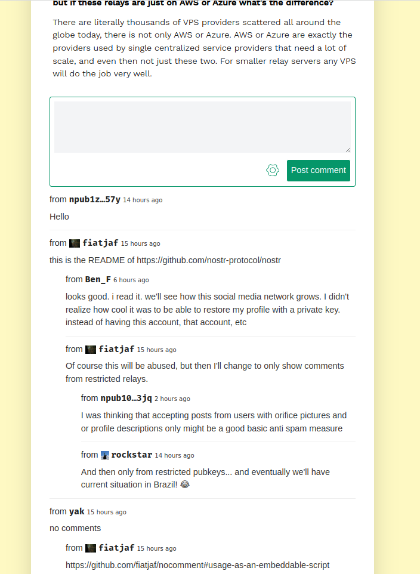

# nocomment

A Nostr-powered embeddable website comments widget that _just works_.

[](https://fiatjaf.com/nostr.html)

## Usage as an embeddable script

Anywhere in your website you want to see the comment box, include

```
<script src="https://nocomment.fiatjaf.com/embed.js" id="nocomment"></script>
```

You can pass special attributes to that `<script>` tag, such as

- `data-relays='["wss://my.custom.relay", "..."]'`, a JSON list of relay URLs to use instead of the default ones.
- `data-custom-base="reference"`, an **optional** event id in hex, `note1` or `nevent1` format, or a `naddr` reference to a [nip33](https://nips.be/33) entity. This will prevent the creation of generic base events.
- `data-skip="/"`, an **optional** path of your website to skip rendering the widgets in. The default is `"/"`.
- `data-owner="reference"`, an **optional** string with the post owner's public key in hex, `npub1` or `nprofile1` format.

Custom CSS variables for styling:

```
--nc-background: #003049;
--nc-container-font-family: arial;
--nc-comment-author-font-size: 1.2em;
--nc-comment-author-font-family: monospace;
--nc-comment-author-font-color: inherit;
--nc-comment-date-font-family: sans-serif;
--nc-comment-fate-font-size: 0.7em;
--nc-text-background: #dddddd;
--nc-text-color: #eae2b7;
--nc-text-color-dark: #fcbf49;
--nc-primary-color: #fcbf49;
--nc-primary-contrast: #003049;
```

## Usage as a React component

1. `yarn add react-nocomment`
2. Don't create an account anywhere.
3. Don't configure a database.
4. It just works. The URL is the identifier.

```
import { NoComment } from 'nocomment'

function App() {
  return (
    ...
      <NoComment relays={[
        'wss://nostr.drss.io',
        'wss://nostr-relay.freeberty.net',
        'wss://nostr.unknown.place',
        'wss://nostr-relay.untethr.me',
        'wss://relay.damus.io'
      ]} />
    ...
  );
}
```

## License

Public domain.
